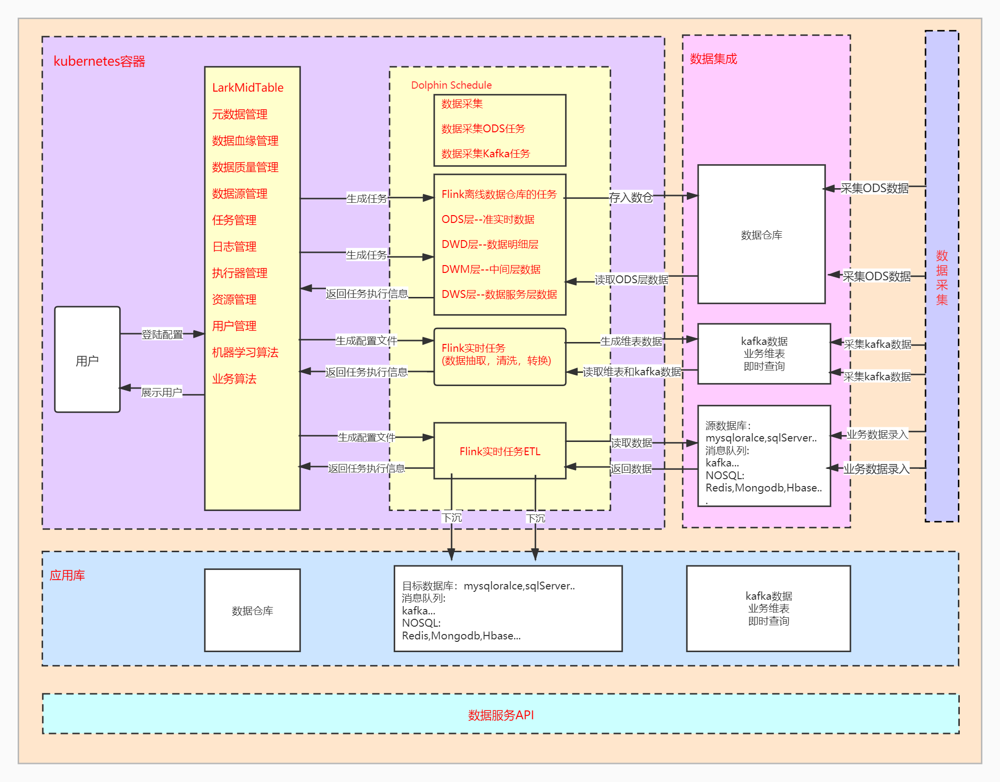
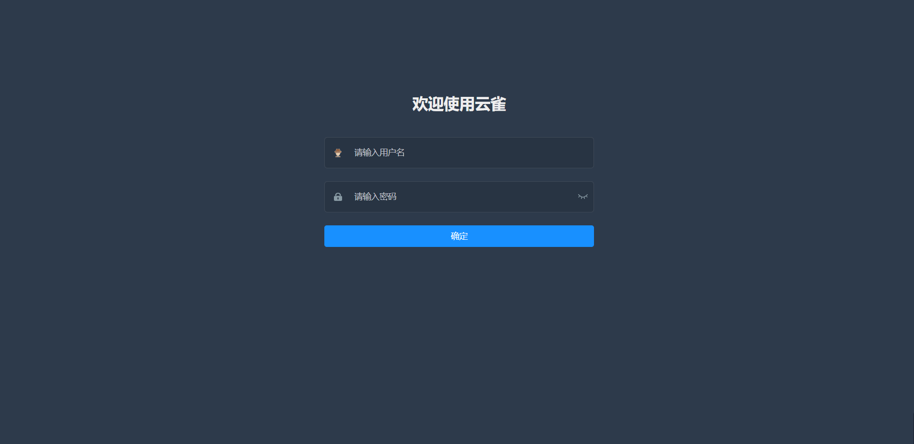
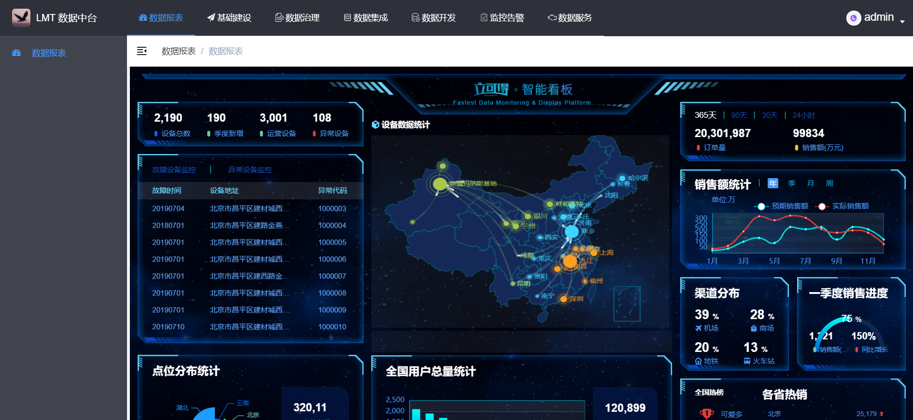
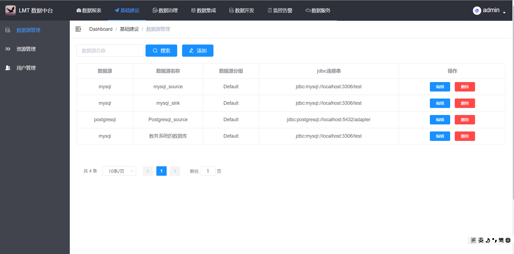
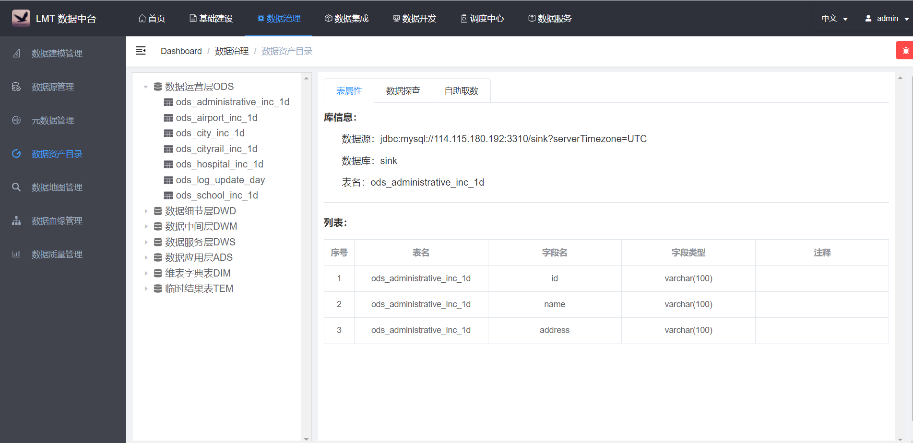
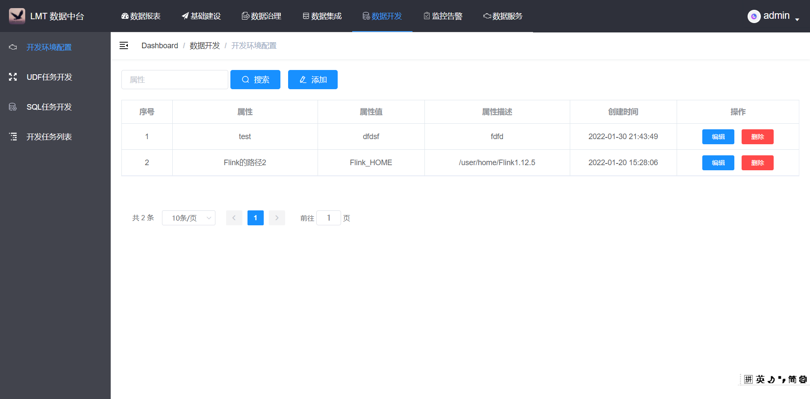
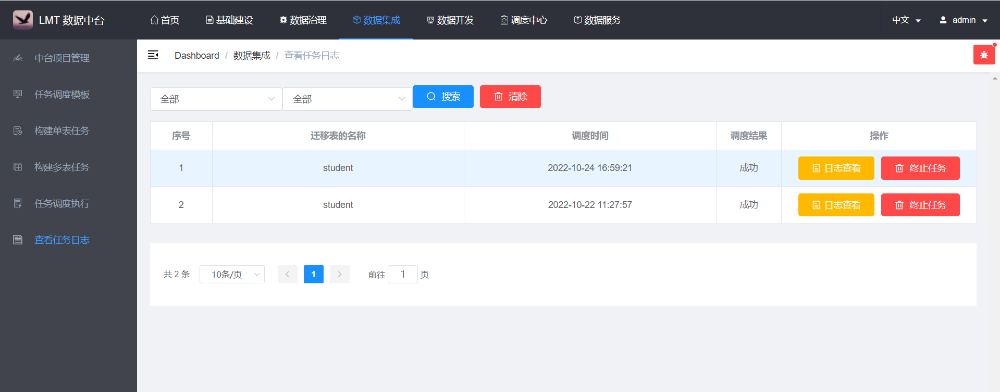
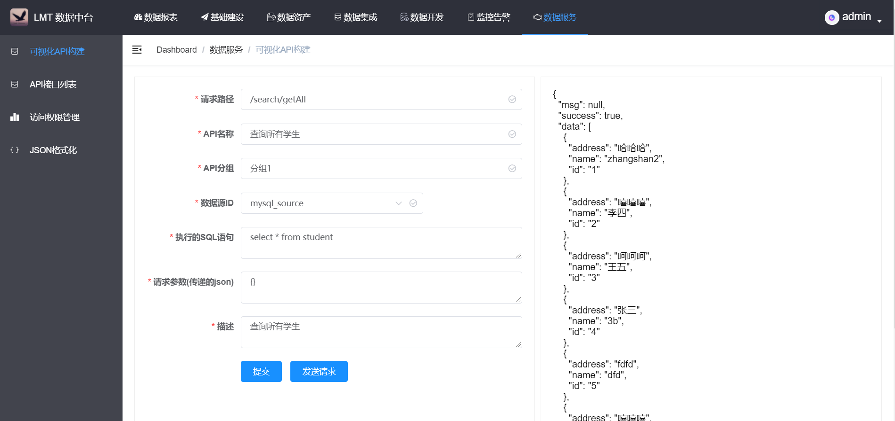

# LarkMidTable

 [中文](README.md)|  [English](README_EN.md)

LarkMidTable 中文名称 云雀，云代表大数据，雀代表平凡和自由。

LarkMidTable 是一站式开源的数据中台，实现元数据管理，数据仓库开发，数据质量管理，数据的可视化，实现高效赋能数据前台并提供数据服务的产品。

# **产品愿景**

1.满足许多的小企业，提供一站式的解决方案。

2.做出世界级别，能够媲美BAT大厂的产品。

3.创造价值，产生价值，让世界变得更加美好。

# 产品架构图

 

# 产品技术选型

| 组件                     | 用途       |
| ------------------------ | ---------- |
| clickhouse/doris         | 离线数仓   |
| kafka                    | 实时数仓   |
| datax,flinkx             | 数据集成   |
| flink,flinkcdc,seatunnel | 数据开发   |
| promicuse                | 数据监控   |
| druid                    | 数据服务   |
| datart                   | 数据可视化 |
| cdh                      | 大数据平台 |
| dolphin                  | 任务调度   |

# 产品效果图

**系统演示地址**：http://124.223.92.186:8080/index.html

**只供 测试 和 商业赞助的客户 使用，服务器流量有限谢谢合作，赞助后加微信 LarkMidTable2021 ，可以领取大数据学习资料 以及 演示地址的用户名和密码 **

# 产品版本

# **快速开始**

安装手册      [安装手册](./larkmidtable-doc/userGuid.md)

操作手册  	[操作手册](./larkmidtable-doc/userManual.md)

开发人员和任务分配    [开发人员和任务分配](./larkmidtable-doc/engineer.md)

# 应用领域

智慧校园 、智慧交通 、智慧金融 、智慧农业、智慧医疗、智慧政务  等多个大数据领域

# 技术交流

**一个人走的很快，一群人走的更远。**

**关注微信公众号 【LarkMidTable】，并回复【LarkMidTable】，获取微信后，加我拉你到微信群，并为你提供全程免费服务，你也可以与其他伙伴交流大数据技术，如果觉得项目不错，可以star关注，LarkMidTable团队将十分感谢您的关注！**
